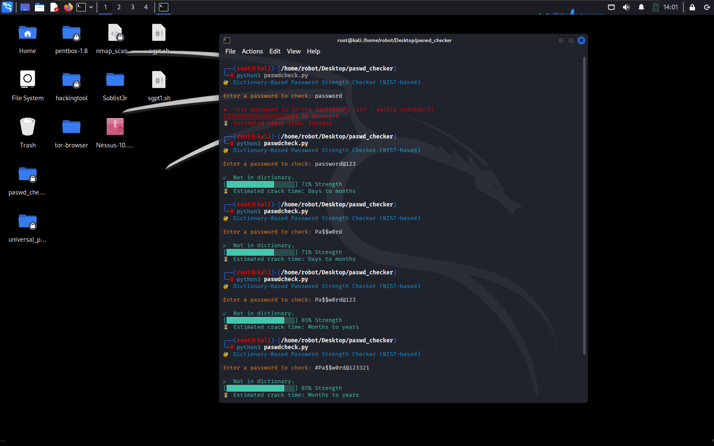

NIST Password Strength Checker (Linux)

Identify weak passwords fast: NIST-inspired strength scoring, dictionary attack detection, and human-readable crack-time estimates. Perfect for demos, training, and security awareness.

  

✨ Features

Dictionary check – flags passwords found in a common-password list (ships with top-100 sample; swap in your own wordlist for realism).

NIST-inspired scoring – rewards length and variety; penalizes predictable patterns (e.g., “Password123!”).

Crack time estimate – quick, friendly ranges (instant → years) to explain risk to non-technical audiences.

Zero dependencies – just Python 3; runs offline.

📦 Project Structure

NIST-Password-Strength-Checker-For-Linux/
├── .gitignore
├── LICENSE
├── README.md
├── demo_passwords.txt       # default dictionary (top-100 sample)
└── passwd_checker.py        # main script

🛠️ Setup
Option A — Quick run (already cloned)

python3 passwd_checker.py

Option B — Fresh clone

git clone https://github.com/mohammed-shanid/NIST-Password-Strength-Checker-For-Linux.git
cd NIST-Password-Strength-Checker-For-Linux
python3 passwd_checker.py

Requires Python 3.x (preinstalled on Kali/Ubuntu). No extra packages.

🚀 Usage

Run the script and enter a password to evaluate:

python3 passwd_checker.py

You’ll see one of two paths:

Found in dictionary → flagged as extremely weak (instant crack).

Not in dictionary → scored (0–100%) + estimated crack time.

## 🖥 Example

Here’s a sample run of the password checker:

📚 Using a Bigger Wordlist (Recommended)

The repo ships with demo_passwords.txt (top-100) for fast demos.
For realism, replace it with a larger list (e.g., Kali’s rockyou.txt):

# If you have rockyou.txt.gz
sudo gzip -d /usr/share/wordlists/rockyou.txt.gz

# Back up the demo file (optional)
mv demo_passwords.txt demo_passwords.bak

# Use rockyou.txt as the dictionary
ln -s /usr/share/wordlists/rockyou.txt demo_passwords.txt

The script reads demo_passwords.txt. Point it to any file by replacing that file (or edit the constant at the top of the script if you prefer).

🧠 Scoring Model (NIST-inspired)

This tool leans on NIST SP 800-63B principles:

Length matters most (≥12 is good; more is better).

Character diversity helps (lower/upper/digit/symbol).

Avoid common passwords (dictionary check).

Avoid predictable patterns (e.g., “Password123”, leetspeak variants).

The output is a percentage (0–100%) + a crack-time range (instant → years) to make risk easy to explain.

Note: This is a demo/awareness tool—not a replacement for enterprise password screening or modern MFA.

🧪 Demo Tips

Try: password, Password123, P@ssw0rd!, correct-horse-battery-staple-2024!

Swap in rockyou.txt for a dramatic “Instant” dictionary hit.

Use it live in workshops or CTF intros to show why length + uniqueness beats complexity rules alone.

🤝 Contributing

Issues and PRs are welcome! Ideas: better pattern checks, breach corpus support, CLI args for custom wordlists, JSON output, or a minimal GUI.

📄 License

MIT © Mohammed Shanid

👋 Author

Mohammed Shanid
GitHub: @mohammed-shanid
LinkedIn: linkedin.com/in/mohammed-shanid-785563262

⭐ If this saved you time, consider starring the repo!
